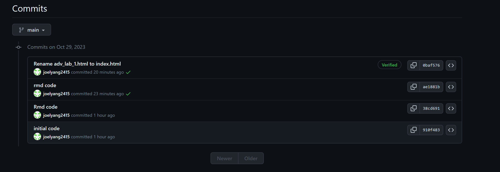

## Loading Packages

```{r setup}
library(ggplot2)
library(sf)
library(tidyverse)
```

## Loading Boulder Data

```{r}
boulder <- st_read("D:/EAS648/lab_1/boulder_data/BoulderSocialMedia.shp")

boulder
```

## Exploring whether photos were taken near natural landmarks

In this part, I plan to explore whether most of the photos were taken near the landmarks, meaning that their NatMrk_Dis value is 0 or near 0. I also added Elevation and Social Media platform as variables, to explore trends in multiple data variables.

```{r}
boulder %>%
  filter(DB ==  'Pano' | DB == 'Flickr') %>%
  ggplot(aes(x = PT_Elev, y = NatMrk_Dis, color = DB)) +
  geom_point(alpha = .3) +
  labs(color = "Social Media")+
  xlab("Elevation (m)") +
  ylab("Distance to Natural Landmarks (m)")
```

In the result picture, we can notice that there is **a line that is parallel to x axis**, meaning that there are certain amount of images were taken at the natrual landmarks, but not most of them. We can also find out that most of the pictures were taken under 2200m. For different social media platforms, we can see that Flickr's pictures are more than the other platform. At the same time, pictures from Flickr are more concentrated, most of them were taken under 1900m, but pictures from Pano are more divergent.

## Exploring whether distribution of photos taken

In this part, I plan to explore the geographical distribution of photos. At the same time, I added variables of different social media to observe the distribution of pictures on different social media.

### Changing Projection and Select Data from Two Social Medias

```{r}
boulder = st_transform(boulder, 26753) 

boulder_social_media = boulder %>% filter(DB ==  'Pano' | DB == 'Flickr')

```

### Data Visualization
```{r}
ggplot() +
    geom_sf(data =boulder_social_media, aes(color = DB),
    fill = NA, alpha = .3) +
  labs(color = "Social Media") +
  xlab("Longitude")+
  ylab("Latitude")
```


From the picture we can see that most of the pictures **were taken north of 39.98 degrees north latitude**, while many pictures are **clustered near 40 degrees north latitude**. There is no direct connection between the different social media and the location of the pictures.

## Discussion 

### The advantages and challenges associated with an open data science approach

The advantage of open data is that it might bring people with rich, detailed, interrelated, timely and lower-cost data. For example, during the presidential election, open data can be used to use some models to fuse multiple variable data to predict the changing trend of public opinion.

Challenges of open data include extracting useful, valid information from it. Due to the large amount of open data and the variety of data, previous quantitative analysis methods are often not fully applicable. More often, researchers need to combine other factors, such as careful rethinking with respect to the philosophy of science.

### Bonus topic




File modification, publishing and other operations can be easily performed using git. The most common operation I use is to modify the file locally, and the code can be quickly updated to github, thereby publishing a new HTML web page, saving a lot of time.

The web page of this Rmd html file is https://joelyang2415.github.io/adv_lab_1/
